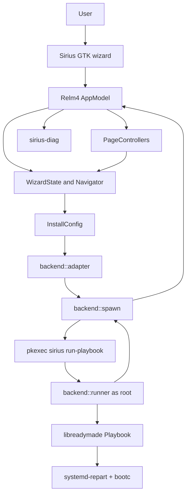
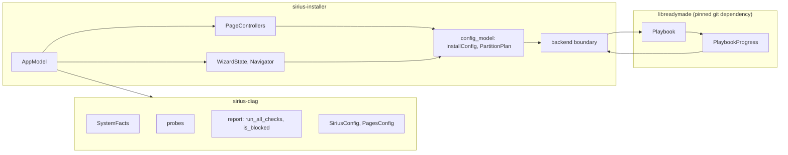
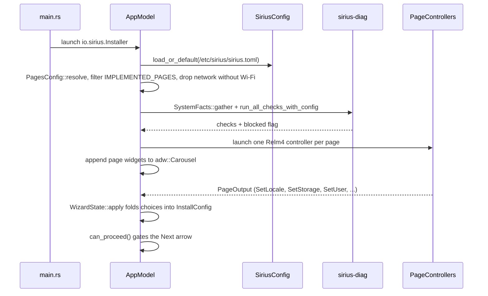
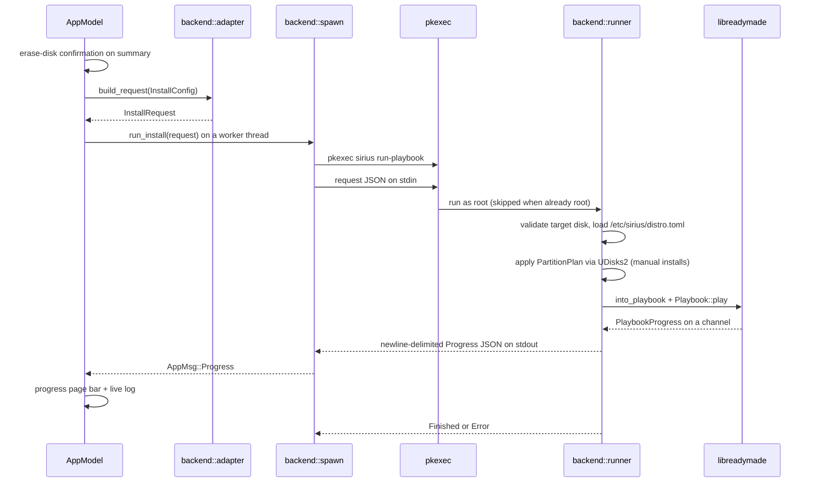
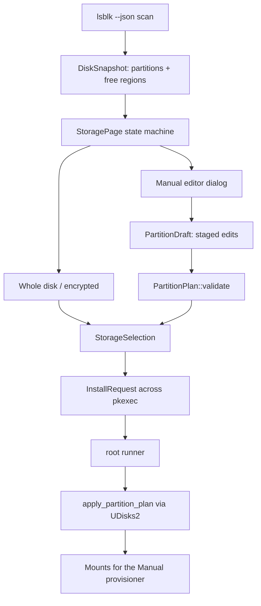
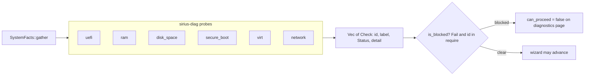
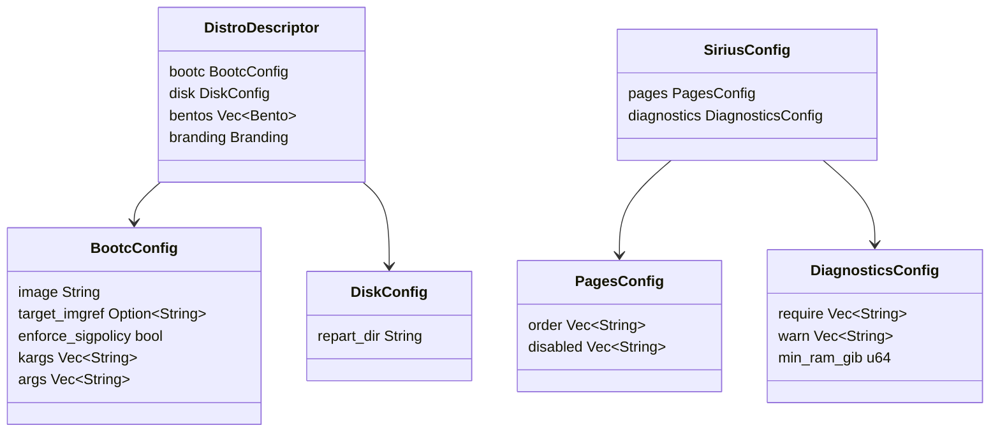

# Sirius Architecture

Sirius is a distro-agnostic diagnostic operating-system installer. It is split into a pure hardware-check and configuration library crate and a Relm4/GTK4/Libadwaita wizard crate, on top of the `libreadymade` install backend.

## Overview



`sirius-installer` owns the window, the wizard pages, the collected `InstallConfig`, and the privilege split. `sirius-diag` owns hardware probes, the `Check`/`Status` model, install gating, and the page-toggle configuration. Disk writes happen only in the privileged `run-playbook` process.

## Crate Boundaries



`sirius-diag` must not import GTK, Libadwaita, or Relm4. Probes take plain values (a path, a byte count, an `Option<bool>`) so they stay unit-testable without hardware; `SystemFacts::gather()` is the only place that touches the live machine. The same library backs the `diag` CLI subcommand and the in-wizard diagnostics page.

## The backend/ Boundary

`crates/sirius-installer/src/backend/` is the only module that touches `libreadymade`, NetworkManager, or UDisks2. Everything else in the UI depends on the `backend::Progress` boundary type, never on upstream types.

- `distro.rs` — the `DistroDescriptor` (`[bootc]` image deployment settings, `[disk]` repart directory, optional `[[bento]]` link cards and `[branding]`), loaded from `/etc/sirius/distro.toml` with an in-tree `data/distro.toml` fallback for dev runs.
- `adapter.rs` — converts the UI's `InstallConfig` into a serializable `InstallRequest`, and the request into a libreadymade `Playbook` on the privileged side.
- `runner.rs` — the privileged half, invoked as `sirius run-playbook`. Reads the request JSON from stdin, executes the playbook, and writes newline-delimited `Progress` JSON to stdout.
- `spawn.rs` — the unprivileged half. Spawns `pkexec sirius run-playbook` (skipped when already root, e.g. a live session), pipes the request to its stdin, and parses progress lines from its stdout.
- `storage.rs` — read-only disk discovery via `lsblk --json` for the UI, plus the UDisks2 executor that applies a confirmed `PartitionPlan` inside the root runner.
- `network.rs` — a small NetworkManager client (scan, connect, Wi-Fi device detection) used by the optional Wi-Fi page.

The request crossing the pkexec boundary carries only the user's choices: target disk, encryption flags, locale/keyboard/timezone, account fields, and an optional `PartitionPlan`. What gets installed — the bootc image and the repart layout — is loaded by the root runner itself from the root-owned `/etc/sirius/distro.toml`, so the unprivileged UI cannot point the root process at an arbitrary image. The runner also re-validates the target: an existing, unmounted whole-disk block device under `/dev`.

`libreadymade` is a pinned git dependency of the luminusOS fork (`rev` in the workspace `Cargo.toml`), built with `default-features = false` to drop the `uutils` copy backend (which would require `libacl-devel`); the native `rdm` copy implementation is used instead.

### Progress Reporting

The runner maps libreadymade's `PlaybookProgress` onto Sirius's own `Progress` enum, serialized as one JSON object per line:

- `Step { fraction, message }` — moves the progress bar. `Stage`/`StageProgress` map to `fraction: 0.0` (upstream emits no fraction there); `PostModule(name, i, total)` reports `i / total`.
- `Log { line }` — a raw line from the runner's stderr, where libreadymade traces the actual work. Shown in the install log, does not move the bar.
- `Finished` / `Error { message }` — terminal states.

On the spawn side, stdout lines that fail to parse are ignored, and a trailing window of stderr lines is kept to enrich the failure message. pkexec exit codes are explained explicitly: 126 means the authorization dialog was dismissed, 127 means authorization failed (or no polkit authentication agent is running).

## Wizard Flow



`AppModel` (`app.rs`) is the root Relm4 component. It owns the `adw::ApplicationWindow`, a non-interactive `adw::Carousel` with one page widget per resolved page id, and overlay navigation arrows (Back/Next) rendered on a `gtk::Overlay`. `PageControllers` (`app/pages.rs`) holds the ten page controllers and routes messages to them.

Navigation state lives in `WizardState` (`app/state.rs`), a GTK-free state machine over `Navigator` (`navigator.rs`), a pure cursor into the resolved page list. The resolved list comes from `sirius.toml`, is filtered to `IMPLEMENTED_PAGES` (`app.rs`: welcome, diagnostics, network, keyboard, timezone, storage, user, summary, progress, finished), and drops the `network` page when NetworkManager reports no Wi-Fi device.

Pages report user choices as `PageOutput` values (`SetLocale`, `SetKeyboard`, `SetTimezone`, `SetStorage`, `SetUser`, `RequestNext`, `RequestInstall`); `WizardState::apply` folds them into the shared `InstallConfig`. **Next-gating is centralized in `WizardState::can_proceed()`**, evaluated on every render: the diagnostics page requires no blocking check, the storage page requires a selected disk (plus a valid `PartitionPlan` for manual installs), the user page requires `UserAccount::validate()`, and progress/finished never advance. Leaving the summary page always goes through the modal erase-and-install confirmation dialog; the confirmation emits `StartInstall`.

Pages that build their widget tree programmatically (currently `diagnostics`, `network`, `storage`, and `summary`) implement `SimpleComponent` by hand instead of using the `#[relm4::component]` macro — a `#[name = ...]` binding inside a `set_child` block fights the macro.

## Install Flow



`into_playbook` wires a `Repart` disk provisioner (layout from the descriptor's `repart_dir`) or a `Manual` provisioner (mounts produced by the UDisks2 executor), a `Bootc` filesystem provisioner (image, target imgref, signature policy, kargs/args from the descriptor), and two postinstall modules: `Language` (the locale) and `InitialSetup`, which writes `/.unconfigured` so the distribution's first-boot agent configures the account and hostname. At the pinned `libreadymade` commit there are no postinstall modules for the user account, hostname, timezone, or keyboard layout — see `docs/GAPS.md`.

## Storage Subsystem



Disk discovery is read-only: `backend/storage.rs` runs `lsblk --json` and builds `DiskSnapshot` values (model, size, table type, partitions, free regions, in-use flag), skipping read-only, zram, and loop devices. The UI never mutates disks.

The storage page (`pages/storage.rs`) is a manual `SimpleComponent` state machine covering disk selection, the automatic (whole-disk/encrypted) path, and the manual path. Its code is split by concern: `page_view.rs` builds the page (disk selector, automatic section), `editor_view.rs` builds the modal editor (usage map and volumes list), `partition_dialog.rs` is the create/edit dialog, and `draft.rs` holds `PartitionDraft` — the pure editing model that stages create/delete/format/label operations into a `PartitionPlan`. Supported filesystems in the editor are btrfs, ext4, vfat, and swap.

A `PartitionPlan` is validated twice: unprivileged in the UI (`validate(uefi)` — GPT table, sane geometry, root of at least 20 GiB, a 512 MiB ESP on UEFI systems) and again in the root runner, which additionally compares it against the live topology before applying it through UDisks2 and passing the resulting mounts to libreadymade's manual provisioner.

## Diagnostics Gating



Each probe owns its own severity (`Pass`/`Warn`/`Fail`) — configuration never reclassifies a check. The `[diagnostics]` policy in `sirius.toml` selects which *failing* checks hard-gate the install (`require`), which ids the UI emphasizes (`warn`, advisory only), and the RAM threshold (`min_ram_gib`, default 2). The default policy requires `uefi`, `ram`, and `disk_space` (20 GiB largest disk) and warns on `secure_boot`, `network`, and `virt`. Facts come from sysfs (`/sys/firmware/efi`, efivars), `sysinfo` (usable RAM), `lsblk`, and `systemd-detect-virt`. The `sirius diag [--json]` subcommand runs the same code path and exits non-zero when blocked.

## Configuration Model And Distro-Agnosticism



No distribution name, image, or hostname is hardcoded in code or `data/`; distro specifics live in configuration:

- `/etc/sirius/distro.toml` — the `DistroDescriptor`: the bootc/OCI image to deploy, the systemd-repart directory (`/usr/share/sirius/repart.d/*.conf`), up to three `[[bento]]` link cards for the progress page, and optional `[branding]` (logo path or themed icon) for the welcome page.
- `/etc/sirius/sirius.toml` — the `SiriusConfig`: page order/disables and the diagnostics policy. `PagesConfig::resolve()` starts from `order` (or the built-in default), drops unknown and disabled ids, migrates the legacy ids `disk`/`partition`/`manual_partition` to `storage`, and always keeps the mandatory pages (`storage`, `progress`, `finished`). A missing or malformed file falls back to defaults with a logged warning.

Per-distribution behavior belongs in these files and the repart layout, never in Rust code.

## Internationalization

```mermaid
flowchart TD
  Po[po/pt_BR.po] --> BuildRs[build.rs: msgfmt --check]
  BuildRs --> OutDir[OUT_DIR/locale, used by dev runs]
  BuildRs --> DataLocale[data/locale, packaged by generate-rpm]
  DataLocale --> Usr[/usr/share/locale on installed systems]
  OutDir --> Bind[bindtextdomain: sirius textdomain, UTF-8]
  Usr --> Bind
  Bind --> Gettext[gettextrs::gettext at render time]
  Welcome[welcome page language picker] --> Lang[LANGUAGE env var]
  Lang --> Gettext
  Lang --> Retranslate[Retranslate broadcast to every page]
  Retranslate --> Gettext
```

Sirius uses GNU gettext via `gettext-rs` (linked against the system libintl). msgids are the English literals passed to `gettextrs::gettext()` in the UI code; catalogs live in `po/` at the repo root (`LINGUAS` lists enabled languages, currently `pt_BR`). `crates/sirius-installer/build.rs` compiles each catalog with `msgfmt --check` into `$OUT_DIR/locale` (used by dev runs through the `SIRIUS_DEV_LOCALEDIR` env) and into `data/locale` for packaging, so `msgfmt` is a required build tool. Installed systems load `/usr/share/locale`.

Runtime language switching needs no restart: the welcome page's language picker emits `SetLocale`, `WizardState` sets the `LANGUAGE` environment variable (glibc gettext consults it on every lookup), and `AppModel` broadcasts a `Retranslate` message to all ten pages, which re-render through gettext on the next `update_view`.

## Design Constraints

- The UI follows GNOME HIG and Libadwaita patterns.
- The UI never touches disks. Mutations run only in the `pkexec sirius run-playbook` process, after the erase-and-install confirmation.
- `sirius-diag` stays free of GTK/Relm4 types; probes consume plain values.
- `backend/` remains the only consumer of libreadymade, NetworkManager, and UDisks2; UI code depends on the `Progress` boundary type.
- The `InstallRequest` carries only user choices. What gets installed comes from the root-owned descriptor, never from the unprivileged side.
- Stay distro-agnostic: no hardcoded distribution names, images, or hostnames in code or `data/`.
- Errors should be actionable — pkexec failures explain the polkit agent requirement, and the install log keeps the runner's stderr tail.
